# Отчёт по автоматизациям Bitrix24

- Сформирован: `2026-04-06T09:37:14+00:00`
- Портал: `b24.elvlift.ru`
- Сущностей: `11`
- Шаблонов: `8`
- Stage-related шаблонов: `0`

## Ограничения

- Отдельного публичного REST-метода для выгрузки всех настроенных CRM-роботов по стадиям Bitrix24 не предоставляет.
- Связи по стадиям и подпроцессам восстанавливаются из шаблонов bizproc.workflow.template.list и их внутренней структуры.
- Для лидов, сделок и смарт-процессов карта стадий строится по официальным CRM status/category методам. Для некоторых CRM-сущностей без устойчивого REST-паттерна стадий может быть доступна только шаблонная часть.

## Сущности CRM

### Лиды (`entityTypeId=1`)

#### Воронки и стадии

- Воронка `Основная` (`id=0`, stageEntityId=`STATUS`)
  - `NEW` Новый -> связанные шаблоны не были восстановлены из структуры шаблонов
  - `CONVERTED` Качественный Лид -> связанные шаблоны не были восстановлены из структуры шаблонов
  - `JUNK` Некачественный Лид -> связанные шаблоны не были восстановлены из структуры шаблонов

#### Mermaid

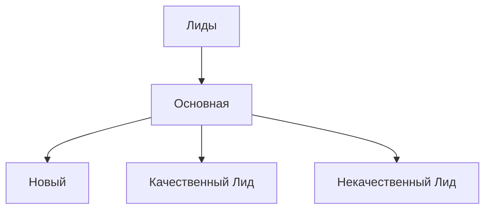

### Сделки (`entityTypeId=2`)

#### Воронки и стадии

- Воронка `Коммерческая воронка` (`id=0`, stageEntityId=`DEAL_STAGE`)
  - `NEW` Анализ ТЗ -> связанные шаблоны не были восстановлены из структуры шаблонов
  - `UC_MKIYN6` Подготовка и отправка КП -> связанные шаблоны не были восстановлены из структуры шаблонов
  - `UC_I070YF` Переговоры -> связанные шаблоны не были восстановлены из структуры шаблонов
  - `EXECUTING` Согласование договора -> связанные шаблоны не были восстановлены из структуры шаблонов
  - `UC_WFZPF0` Счет на аванс -> связанные шаблоны не были восстановлены из структуры шаблонов
  - `FINAL_INVOICE` Аванс получен -> связанные шаблоны не были восстановлены из структуры шаблонов
  - `UC_1LOS62` Оборудование -> связанные шаблоны не были восстановлены из структуры шаблонов
  - `2` Монтаж -> связанные шаблоны не были восстановлены из структуры шаблонов
  - `3` Окончательный расчет -> связанные шаблоны не были восстановлены из структуры шаблонов
  - `WON` Сделка успешна -> связанные шаблоны не были восстановлены из структуры шаблонов
  - `LOSE` Сделка провалена -> связанные шаблоны не были восстановлены из структуры шаблонов
- Воронка `Тендерная продажа` (`id=1`, stageEntityId=`DEAL_STAGE_1`)
  - `C1:NEW` Новый тендер -> связанные шаблоны не были восстановлены из структуры шаблонов
  - `C1:PREPARATION` Смета/расчет -> связанные шаблоны не были восстановлены из структуры шаблонов
  - `C1:PREPAYMENT_INVOICE` Согласование -> связанные шаблоны не были восстановлены из структуры шаблонов
  - `C1:EXECUTING` Подача заявки -> связанные шаблоны не были восстановлены из структуры шаблонов
  - `C1:FINAL_INVOICE` Торги -> связанные шаблоны не были восстановлены из структуры шаблонов
  - `C1:1` Ожидание итогов -> связанные шаблоны не были восстановлены из структуры шаблонов
  - `C1:2` Выполнение обязательств -> связанные шаблоны не были восстановлены из структуры шаблонов
  - `C1:3` Окончательный расчет -> связанные шаблоны не были восстановлены из структуры шаблонов
  - `C1:WON` Сделка успешна -> связанные шаблоны не были восстановлены из структуры шаблонов
  - `C1:LOSE` Сделка провалена -> связанные шаблоны не были восстановлены из структуры шаблонов
- Воронка `Продажа по ФЗ` (`id=2`, stageEntityId=`DEAL_STAGE_2`)
  - `C2:NEW` Новый тендер -> связанные шаблоны не были восстановлены из структуры шаблонов
  - `C2:PREPARATION` Расчет/смета -> связанные шаблоны не были восстановлены из структуры шаблонов
  - `C2:PREPAYMENT_INVOICE` Согласование -> связанные шаблоны не были восстановлены из структуры шаблонов
  - `C2:EXECUTING` Подача заявки -> связанные шаблоны не были восстановлены из структуры шаблонов
  - `C2:FINAL_INVOICE` Торги -> связанные шаблоны не были восстановлены из структуры шаблонов
  - `C2:UC_UMTNQO` Ожидание итогов -> связанные шаблоны не были восстановлены из структуры шаблонов
  - `C2:UC_G71QY3` Выполнение обязательств -> связанные шаблоны не были восстановлены из структуры шаблонов
  - `C2:UC_ZWM3RV` Окончательный расчет -> связанные шаблоны не были восстановлены из структуры шаблонов
  - `C2:WON` Сделка успешна -> связанные шаблоны не были восстановлены из структуры шаблонов
  - `C2:LOSE` Сделка провалена -> связанные шаблоны не были восстановлены из структуры шаблонов
- Воронка `Долгосрочная` (`id=4`, stageEntityId=`DEAL_STAGE_4`)
  - `C4:NEW` Переговоры -> связанные шаблоны не были восстановлены из структуры шаблонов
  - `C4:WON` Перевод в сделку -> связанные шаблоны не были восстановлены из структуры шаблонов
  - `C4:LOSE` Не подтвердилась -> связанные шаблоны не были восстановлены из структуры шаблонов

#### Шаблоны уровня сущности

- [79] Прикрепить лифт (`manual_business_process`, launch=`manual`)
- [80] Прикрепление объекта (`event_business_process`, launch=`on_update`)
- [107] Постановака ответственного (`manual_business_process`, launch=`manual`)

#### Mermaid

```mermaid
flowchart TD
  E2["Сделки"]
  C2_0["Коммерческая воронка"]
  E2 --> C2_0
  S_2_0_NEW["Анализ ТЗ"]
  C2_0 --> S_2_0_NEW
  S_2_0_UC_MKIYN6["Подготовка и отправка КП"]
  C2_0 --> S_2_0_UC_MKIYN6
  S_2_0_UC_I070YF["Переговоры"]
  C2_0 --> S_2_0_UC_I070YF
  S_2_0_EXECUTING["Согласование договора"]
  C2_0 --> S_2_0_EXECUTING
  S_2_0_UC_WFZPF0["Счет на аванс"]
  C2_0 --> S_2_0_UC_WFZPF0
  S_2_0_FINAL_INVOICE["Аванс получен"]
  C2_0 --> S_2_0_FINAL_INVOICE
  S_2_0_UC_1LOS62["Оборудование"]
  C2_0 --> S_2_0_UC_1LOS62
  S_2_0_2["Монтаж"]
  C2_0 --> S_2_0_2
  S_2_0_3["Окончательный расчет"]
  C2_0 --> S_2_0_3
  S_2_0_WON["Сделка успешна"]
  C2_0 --> S_2_0_WON
  S_2_0_LOSE["Сделка провалена"]
  C2_0 --> S_2_0_LOSE
  C2_1["Тендерная продажа"]
  E2 --> C2_1
  S_2_1_C1_NEW["Новый тендер"]
  C2_1 --> S_2_1_C1_NEW
  S_2_1_C1_PREPARATION["Смета/расчет"]
  C2_1 --> S_2_1_C1_PREPARATION
  S_2_1_C1_PREPAYMENT_INVOICE["Согласование"]
  C2_1 --> S_2_1_C1_PREPAYMENT_INVOICE
  S_2_1_C1_EXECUTING["Подача заявки"]
  C2_1 --> S_2_1_C1_EXECUTING
  S_2_1_C1_FINAL_INVOICE["Торги"]
  C2_1 --> S_2_1_C1_FINAL_INVOICE
  S_2_1_C1_1["Ожидание итогов"]
  C2_1 --> S_2_1_C1_1
  S_2_1_C1_2["Выполнение обязательств"]
  C2_1 --> S_2_1_C1_2
  S_2_1_C1_3["Окончательный расчет"]
  C2_1 --> S_2_1_C1_3
  S_2_1_C1_WON["Сделка успешна"]
  C2_1 --> S_2_1_C1_WON
  S_2_1_C1_LOSE["Сделка провалена"]
  C2_1 --> S_2_1_C1_LOSE
  C2_2["Продажа по ФЗ"]
  E2 --> C2_2
  S_2_2_C2_NEW["Новый тендер"]
  C2_2 --> S_2_2_C2_NEW
  S_2_2_C2_PREPARATION["Расчет/смета"]
  C2_2 --> S_2_2_C2_PREPARATION
  S_2_2_C2_PREPAYMENT_INVOICE["Согласование"]
  C2_2 --> S_2_2_C2_PREPAYMENT_INVOICE
  S_2_2_C2_EXECUTING["Подача заявки"]
  C2_2 --> S_2_2_C2_EXECUTING
  S_2_2_C2_FINAL_INVOICE["Торги"]
  C2_2 --> S_2_2_C2_FINAL_INVOICE
  S_2_2_C2_UC_UMTNQO["Ожидание итогов"]
  C2_2 --> S_2_2_C2_UC_UMTNQO
  S_2_2_C2_UC_G71QY3["Выполнение обязательств"]
  C2_2 --> S_2_2_C2_UC_G71QY3
  S_2_2_C2_UC_ZWM3RV["Окончательный расчет"]
  C2_2 --> S_2_2_C2_UC_ZWM3RV
  S_2_2_C2_WON["Сделка успешна"]
  C2_2 --> S_2_2_C2_WON
  S_2_2_C2_LOSE["Сделка провалена"]
  C2_2 --> S_2_2_C2_LOSE
  C2_4["Долгосрочная"]
  E2 --> C2_4
  S_2_4_C4_NEW["Переговоры"]
  C2_4 --> S_2_4_C4_NEW
  S_2_4_C4_WON["Перевод в сделку"]
  C2_4 --> S_2_4_C4_WON
  S_2_4_C4_LOSE["Не подтвердилась"]
  C2_4 --> S_2_4_C4_LOSE
  T79["[79] Прикрепить лифт"]
  E2 -->|binds| T79
  T80["[80] Прикрепление объекта"]
  E2 -->|binds| T80
  T107["[107] Постановака ответственного"]
  E2 -->|binds| T107
```

### Контакты (`entityTypeId=3`)

#### Воронки и стадии

- Воронка `Общая воронка` (`id=0`, stageEntityId=`n/a`)
  - Стадии не были получены через CRM status API.
- Воронка `Category 1` (`id=1`, stageEntityId=`n/a`)
  - Стадии не были получены через CRM status API.
- Воронка `Контакты поставщика` (`id=4`, stageEntityId=`n/a`)
  - Стадии не были получены через CRM status API.

#### Mermaid

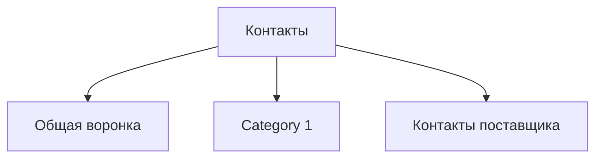

### Компании (`entityTypeId=4`)

#### Воронки и стадии

- Воронка `Общая воронка` (`id=0`, stageEntityId=`n/a`)
  - Стадии не были получены через CRM status API.
- Воронка `Поставщики` (`id=5`, stageEntityId=`n/a`)
  - Стадии не были получены через CRM status API.

#### Шаблоны уровня сущности

- [76] Заведение ИНН (`event_business_process`, launch=`on_create`)
- [156] Рассылка писем (`manual_business_process`, launch=`manual`)

#### Mermaid

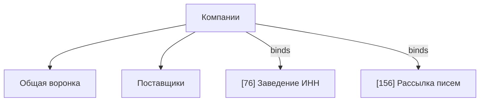

### Предложения (`entityTypeId=7`)

#### Воронки и стадии

- Воронка `Основная` (`id=0`, stageEntityId=`QUOTE_STATUS`)
  - `DRAFT` Новое -> связанные шаблоны не были восстановлены из структуры шаблонов
  - `SENT` Отправлено клиенту -> связанные шаблоны не были восстановлены из структуры шаблонов
  - `APPROVED` Принято -> связанные шаблоны не были восстановлены из структуры шаблонов
  - `DECLAINED` Отклонено -> связанные шаблоны не были восстановлены из структуры шаблонов
  - `APOLOGY` Анализ причины отклонения -> связанные шаблоны не были восстановлены из структуры шаблонов

#### Mermaid

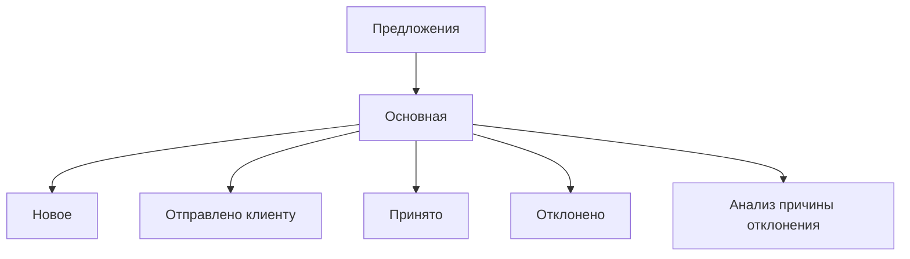

### Смарт-счета (`entityTypeId=31`)

#### Воронки и стадии

- Воронка `Общая` (`id=3`, stageEntityId=`n/a`)
  - Стадии не были получены через CRM status API.

#### Mermaid

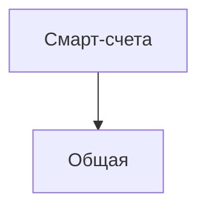

### Договор (`entityTypeId=1036`)

#### Воронки и стадии

- Воронка `Общая` (`id=6`, stageEntityId=`DYNAMIC_1036_STAGE_6`)
  - `DT1036_6:NEW` Начало -> связанные шаблоны не были восстановлены из структуры шаблонов
  - `DT1036_6:PREPARATION` Подготовка -> связанные шаблоны не были восстановлены из структуры шаблонов
  - `DT1036_6:CLIENT` Согласование -> связанные шаблоны не были восстановлены из структуры шаблонов
  - `DT1036_6:SUCCESS` Заключен -> связанные шаблоны не были восстановлены из структуры шаблонов
  - `DT1036_6:FAIL` Провал -> связанные шаблоны не были восстановлены из структуры шаблонов

#### Шаблоны уровня сущности

- [82] Привязка компаний и контактов (`manual_business_process`, launch=`manual`)

#### Mermaid

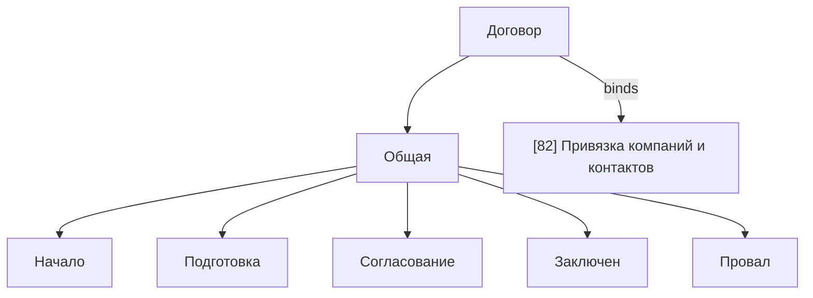

### Лифт (`entityTypeId=1046`)

#### Воронки и стадии

- Воронка `Общая` (`id=8`, stageEntityId=`DYNAMIC_1046_STAGE_8`)
  - `DT1046_8:NEW` Начало -> связанные шаблоны не были восстановлены из структуры шаблонов
  - `DT1046_8:PREPARATION` Подготовка -> связанные шаблоны не были восстановлены из структуры шаблонов
  - `DT1046_8:CLIENT` Согласование -> связанные шаблоны не были восстановлены из структуры шаблонов
  - `DT1046_8:SUCCESS` Успех -> связанные шаблоны не были восстановлены из структуры шаблонов
  - `DT1046_8:FAIL` Провал -> связанные шаблоны не были восстановлены из структуры шаблонов

#### Шаблоны уровня сущности

- [78] Добавление в сделку (`event_business_process`, launch=`on_create`)

#### Mermaid

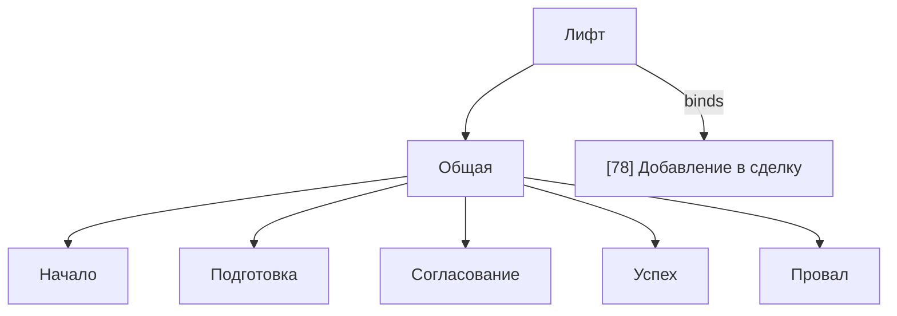

### Объект (`entityTypeId=1050`)

#### Воронки и стадии

- Воронка `Общая` (`id=9`, stageEntityId=`DYNAMIC_1050_STAGE_9`)
  - `DT1050_9:NEW` Начало -> связанные шаблоны не были восстановлены из структуры шаблонов
  - `DT1050_9:PREPARATION` Подготовка -> связанные шаблоны не были восстановлены из структуры шаблонов
  - `DT1050_9:CLIENT` Согласование -> связанные шаблоны не были восстановлены из структуры шаблонов
  - `DT1050_9:SUCCESS` Успех -> связанные шаблоны не были восстановлены из структуры шаблонов
  - `DT1050_9:FAIL` Провал -> связанные шаблоны не были восстановлены из структуры шаблонов

#### Шаблоны уровня сущности

- [77] Создание лифтов (`event_business_process`, launch=`on_create_or_update`)

#### Mermaid

### Марка лифта (`entityTypeId=1054`)

#### Воронки и стадии

- Воронка `Общая` (`id=10`, stageEntityId=`DYNAMIC_1054_STAGE_10`)
  - `DT1054_10:NEW` Начало -> связанные шаблоны не были восстановлены из структуры шаблонов
  - `DT1054_10:PREPARATION` Подготовка -> связанные шаблоны не были восстановлены из структуры шаблонов
  - `DT1054_10:CLIENT` Согласование -> связанные шаблоны не были восстановлены из структуры шаблонов
  - `DT1054_10:SUCCESS` Успех -> связанные шаблоны не были восстановлены из структуры шаблонов
  - `DT1054_10:FAIL` Провал -> связанные шаблоны не были восстановлены из структуры шаблонов

#### Mermaid

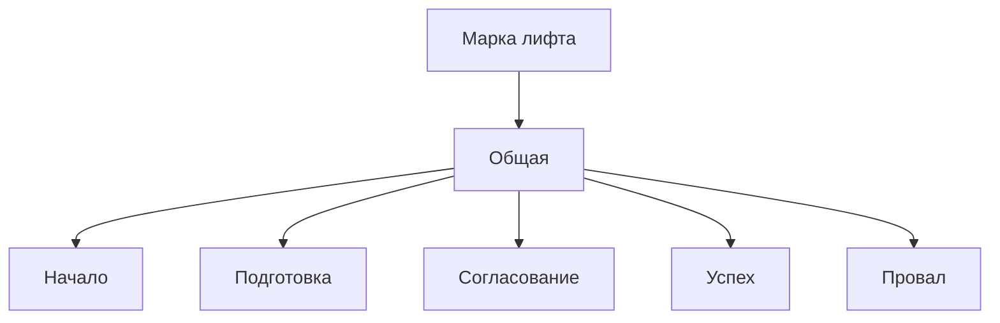

### Юридические лица (`entityTypeId=1058`)

#### Воронки и стадии

- Воронка `Общая` (`id=11`, stageEntityId=`DYNAMIC_1058_STAGE_11`)
  - `DT1058_11:NEW` Начало -> связанные шаблоны не были восстановлены из структуры шаблонов
  - `DT1058_11:PREPARATION` Подготовка -> связанные шаблоны не были восстановлены из структуры шаблонов
  - `DT1058_11:CLIENT` Согласование -> связанные шаблоны не были восстановлены из структуры шаблонов
  - `DT1058_11:SUCCESS` Успех -> связанные шаблоны не были восстановлены из структуры шаблонов
  - `DT1058_11:FAIL` Провал -> связанные шаблоны не были восстановлены из структуры шаблонов

#### Mermaid

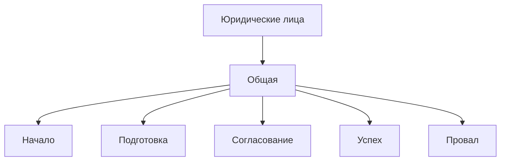

## Каталог шаблонов

### [76] Заведение ИНН

- Класс: `event_business_process`
- Режим запуска: `on_create`
- Документ: `COMPANY` / `Компании`
- Изменён: `2025-10-16T21:59:08+00:00`
- Автор изменения: `bitrix@elvlift.ru`
- Ссылки на поля: `Document:UF_CRM_1760640732106`

#### Краткий outline

- `activity` Template — Activated=Y; Title=Последовательный бизнес-процесс
  - `activity` A129_2024_58415_74182 — Activated=Y; CrmEntityType=CONTACT; RequisitePresetId=1

### [77] Создание лифтов

- Класс: `event_business_process`
- Режим запуска: `on_create_or_update`
- Документ: `DYNAMIC_1050` / `Объект`
- Изменён: `2025-10-17T09:41:06+00:00`
- Автор изменения: `bitrix@elvlift.ru`
- Запускает шаблоны: `79`
- Ссылки на поля: `A16680_24452_19825_18929:ItemId, Document:ASSIGNED_BY_ID, Document:COMPANY_ID, Document:ID, Document:PARENT_ID_1036, Document:PARENT_ID_2, Document:UF_CRM_6_1760643248, System:Date, Variable:Variable1, workdateadd({=System:Date`

#### Краткий outline

- `activity` Template — Activated=Y; Title=Последовательный бизнес-процесс
  - `activity` A21925_18477_33593_78217 — Activated=Y; Title=Изменение переменных; EditorComment=
  - `condition` A13363_81693_72355_22422 — Activated=Y; Title=Условие
    - `condition` A71146_67485_42747_25329 — Activated=Y; Title=Условие; EditorComment=
    - `condition` A93906_65331_89701_78002 — Activated=Y; Title=Условие; EditorComment=
      - `field_update` A54992_81798_51544_79448 — Activated=Y; MergeMultipleFields=N; Title=Изменение документа
      - `activity` A86688_88850_836_70068 — Activated=Y; Title=Цикл; EditorComment=
        - `activity` A30278_24191_55055_32744 — Activated=Y; Title=Последовательность действий
          - `activity` A16680_24452_19825_18929 — Activated=Y; DynamicTypeId=1046; OnlyDynamicEntities=Y
          - `start_workflow` A53636_93735_16376_50030 — Activated=Y; DocumentId={=Document:PARENT_ID_2}; TemplateId=79
          - `activity` A51731_45968_36344_64444 — Activated=Y; Title=Изменение переменных; EditorComment=
          - `condition` A83367_20914_47027_66146 — Activated=Y; Title=Условие; _DesMinimized=Y
            - `condition` A84042_72031_89662_42096 — Activated=Y; Title=Условие; EditorComment=
              - `activity` A56114_27331_31566_17181 — Activated=Y; StateTitle=Выполнение прервано; KillWorkflow=N
            - `condition` A79302_67627_24994_41262 — Activated=Y; Title=Условие

### [78] Добавление в сделку

- Класс: `event_business_process`
- Режим запуска: `on_create`
- Документ: `DYNAMIC_1046` / `Лифт`
- Изменён: `2025-10-16T23:34:20+00:00`
- Автор изменения: `bitrix@elvlift.ru`

#### Краткий outline

- `activity` Template — Activated=Y; Title=Последовательный бизнес-процесс

### [79] Прикрепить лифт

- Класс: `manual_business_process`
- Режим запуска: `manual`
- Документ: `DEAL` / `Сделки`
- Изменён: `2025-10-16T23:41:31+00:00`
- Автор изменения: `bitrix@elvlift.ru`
- Ссылки на поля: `Template:Parameter1`
- Параметры: `Parameter1`

#### Краткий outline

- `activity` Template — Activated=Y; Title=Последовательный бизнес-процесс
  - `field_update` A30927_25026_27260_80286 — Activated=Y; MergeMultipleFields=Y; Title=Изменение документа

### [80] Прикрепление объекта

- Класс: `event_business_process`
- Режим запуска: `on_update`
- Документ: `DEAL` / `Сделки`
- Изменён: `2025-10-16T23:41:22+00:00`
- Автор изменения: `bitrix@elvlift.ru`
- Ссылки на поля: `A33426_22417_13483_43298:Value, Document:ID`

#### Краткий outline

- `activity` Template — Activated=Y; Title=Последовательный бизнес-процесс
  - `activity` A33426_22417_13483_43298 — Activated=Y; Variable=UF_CRM_1760618213; Object=Document
    - `activity` A19947_37159_26514_48080 — Activated=Y; Title=Последовательность действий
      - `activity` A21304_61516_83839_11098 — Activated=Y; DynamicTypeId=1050; DynamicId=

### [82] Привязка компаний и контактов

- Класс: `manual_business_process`
- Режим запуска: `manual`
- Документ: `DYNAMIC_1036` / `Договор`
- Изменён: `2025-10-20T14:02:47+00:00`
- Автор изменения: `bitrix@elvlift.ru`
- Ссылки на поля: `A29200_69918_18089_44159:ID, A93428_28015_20127_46440:ID, Document:UF_CRM_3_1760952574, Document:UF_CRM_3_1760952607`

#### Краткий outline

- `activity` Template — Activated=Y; Title=Последовательный бизнес-процесс
  - `activity` A93428_28015_20127_46440 — Activated=Y; DynamicTypeId=4; OnlyDynamicEntities=N
  - `activity` A29200_69918_18089_44159 — Activated=Y; DynamicTypeId=4; OnlyDynamicEntities=N
  - `field_update` A50330_49053_38535_21890 — Activated=Y; MergeMultipleFields=N; Title=Изменение документа

### [107] Постановака ответственного

- Класс: `manual_business_process`
- Режим запуска: `manual`
- Документ: `DEAL` / `Сделки`
- Изменён: `2025-10-24T17:17:45+00:00`
- Автор изменения: `bitrix@elvlift.ru`
- Ссылки на поля: `A18624_57782_78368_22730:GetUser>printable, Document:COMMENTS`

#### Краткий outline

- `activity` Template — Activated=Y; Title=Последовательный бизнес-процесс
  - `activity` A18624_57782_78368_22730 — Activated=Y; UserType=random; MaxLevel=1
  - `notification` A36882_11686_27912_77517 — Activated=Y; MessageSite={=A18624_57782_78368_22730:GetUser>printable}; MessageOut=
  - `activity` A82675_32762_58287_98529 — Activated=N; Title=Изменить ответственного; EditorComment=

### [156] Рассылка писем

- Класс: `manual_business_process`
- Режим запуска: `manual`
- Документ: `COMPANY` / `Компании`
- Изменён: `2025-10-29T12:52:02+00:00`
- Автор изменения: `bitrix@elvlift.ru`
- Ссылки на поля: `Document:ASSIGNED_BY_ID, Template:Parameter1, Template:Parameter2`
- Параметры: `Parameter1, Parameter2`

#### Краткий outline

- `activity` Template — Activated=Y; Title=Последовательный бизнес-процесс
  - `activity` A65460_14829_75972_3544 — Activated=Y; MailSubject={=Template:Parameter1}; MailText={=Template:Parameter2}

## Общая Mermaid-схема

```mermaid
flowchart TD
  E1["Лиды"]
  C1_0["Основная"]
  E1 -->|contains| C1_0
  S_1_0_NEW["Новый [NEW]"]
  C1_0 -->|contains| S_1_0_NEW
  S_1_0_CONVERTED["Качественный Лид [CONVERTED]"]
  C1_0 -->|contains| S_1_0_CONVERTED
  S_1_0_JUNK["Некачественный Лид [JUNK]"]
  C1_0 -->|contains| S_1_0_JUNK
  E2["Сделки"]
  C2_0["Коммерческая воронка"]
  E2 -->|contains| C2_0
  S_2_0_NEW["Анализ ТЗ [NEW]"]
  C2_0 -->|contains| S_2_0_NEW
  S_2_0_UC_MKIYN6["Подготовка и отправка КП [UC_MKIYN6]"]
  C2_0 -->|contains| S_2_0_UC_MKIYN6
  S_2_0_UC_I070YF["Переговоры [UC_I070YF]"]
  C2_0 -->|contains| S_2_0_UC_I070YF
  S_2_0_EXECUTING["Согласование договора [EXECUTING]"]
  C2_0 -->|contains| S_2_0_EXECUTING
  S_2_0_UC_WFZPF0["Счет на аванс [UC_WFZPF0]"]
  C2_0 -->|contains| S_2_0_UC_WFZPF0
  S_2_0_FINAL_INVOICE["Аванс получен [FINAL_INVOICE]"]
  C2_0 -->|contains| S_2_0_FINAL_INVOICE
  S_2_0_UC_1LOS62["Оборудование [UC_1LOS62]"]
  C2_0 -->|contains| S_2_0_UC_1LOS62
  S_2_0_2["Монтаж [2]"]
  C2_0 -->|contains| S_2_0_2
  S_2_0_3["Окончательный расчет [3]"]
  C2_0 -->|contains| S_2_0_3
  S_2_0_WON["Сделка успешна [WON]"]
  C2_0 -->|contains| S_2_0_WON
  S_2_0_LOSE["Сделка провалена [LOSE]"]
  C2_0 -->|contains| S_2_0_LOSE
  C2_1["Тендерная продажа"]
  E2 -->|contains| C2_1
  S_2_1_C1_NEW["Новый тендер [C1:NEW]"]
  C2_1 -->|contains| S_2_1_C1_NEW
  S_2_1_C1_PREPARATION["Смета/расчет [C1:PREPARATION]"]
  C2_1 -->|contains| S_2_1_C1_PREPARATION
  S_2_1_C1_PREPAYMENT_INVOICE["Согласование [C1:PREPAYMENT_INVOICE]"]
  C2_1 -->|contains| S_2_1_C1_PREPAYMENT_INVOICE
  S_2_1_C1_EXECUTING["Подача заявки [C1:EXECUTING]"]
  C2_1 -->|contains| S_2_1_C1_EXECUTING
  S_2_1_C1_FINAL_INVOICE["Торги [C1:FINAL_INVOICE]"]
  C2_1 -->|contains| S_2_1_C1_FINAL_INVOICE
  S_2_1_C1_1["Ожидание итогов [C1:1]"]
  C2_1 -->|contains| S_2_1_C1_1
  S_2_1_C1_2["Выполнение обязательств [C1:2]"]
  C2_1 -->|contains| S_2_1_C1_2
  S_2_1_C1_3["Окончательный расчет [C1:3]"]
  C2_1 -->|contains| S_2_1_C1_3
  S_2_1_C1_WON["Сделка успешна [C1:WON]"]
  C2_1 -->|contains| S_2_1_C1_WON
  S_2_1_C1_LOSE["Сделка провалена [C1:LOSE]"]
  C2_1 -->|contains| S_2_1_C1_LOSE
  C2_2["Продажа по ФЗ"]
  E2 -->|contains| C2_2
  S_2_2_C2_NEW["Новый тендер [C2:NEW]"]
  C2_2 -->|contains| S_2_2_C2_NEW
  S_2_2_C2_PREPARATION["Расчет/смета [C2:PREPARATION]"]
  C2_2 -->|contains| S_2_2_C2_PREPARATION
  S_2_2_C2_PREPAYMENT_INVOICE["Согласование [C2:PREPAYMENT_INVOICE]"]
  C2_2 -->|contains| S_2_2_C2_PREPAYMENT_INVOICE
  S_2_2_C2_EXECUTING["Подача заявки [C2:EXECUTING]"]
  C2_2 -->|contains| S_2_2_C2_EXECUTING
  S_2_2_C2_FINAL_INVOICE["Торги [C2:FINAL_INVOICE]"]
  C2_2 -->|contains| S_2_2_C2_FINAL_INVOICE
  S_2_2_C2_UC_UMTNQO["Ожидание итогов [C2:UC_UMTNQO]"]
  C2_2 -->|contains| S_2_2_C2_UC_UMTNQO
  S_2_2_C2_UC_G71QY3["Выполнение обязательств [C2:UC_G71QY3]"]
  C2_2 -->|contains| S_2_2_C2_UC_G71QY3
  S_2_2_C2_UC_ZWM3RV["Окончательный расчет [C2:UC_ZWM3RV]"]
  C2_2 -->|contains| S_2_2_C2_UC_ZWM3RV
  S_2_2_C2_WON["Сделка успешна [C2:WON]"]
  C2_2 -->|contains| S_2_2_C2_WON
  S_2_2_C2_LOSE["Сделка провалена [C2:LOSE]"]
  C2_2 -->|contains| S_2_2_C2_LOSE
  C2_4["Долгосрочная"]
  E2 -->|contains| C2_4
  S_2_4_C4_NEW["Переговоры [C4:NEW]"]
  C2_4 -->|contains| S_2_4_C4_NEW
  S_2_4_C4_WON["Перевод в сделку [C4:WON]"]
  C2_4 -->|contains| S_2_4_C4_WON
  S_2_4_C4_LOSE["Не подтвердилась [C4:LOSE]"]
  C2_4 -->|contains| S_2_4_C4_LOSE
  T79["[79] Прикрепить лифт"]
  E2 -->|binds| T79
  T80["[80] Прикрепление объекта"]
  E2 -->|binds| T80
  T107["[107] Постановака ответственного"]
  E2 -->|binds| T107
  E3["Контакты"]
  C3_0["Общая воронка"]
  E3 -->|contains| C3_0
  C3_1["Category 1"]
  E3 -->|contains| C3_1
  C3_4["Контакты поставщика"]
  E3 -->|contains| C3_4
  E4["Компании"]
  C4_0["Общая воронка"]
  E4 -->|contains| C4_0
  C4_5["Поставщики"]
  E4 -->|contains| C4_5
  T76["[76] Заведение ИНН"]
  E4 -->|binds| T76
  T156["[156] Рассылка писем"]
  E4 -->|binds| T156
  E7["Предложения"]
  C7_0["Основная"]
  E7 -->|contains| C7_0
  S_7_0_DRAFT["Новое [DRAFT]"]
  C7_0 -->|contains| S_7_0_DRAFT
  S_7_0_SENT["Отправлено клиенту [SENT]"]
  C7_0 -->|contains| S_7_0_SENT
  S_7_0_APPROVED["Принято [APPROVED]"]
  C7_0 -->|contains| S_7_0_APPROVED
  S_7_0_DECLAINED["Отклонено [DECLAINED]"]
  C7_0 -->|contains| S_7_0_DECLAINED
  S_7_0_APOLOGY["Анализ причины отклонения [APOLOGY]"]
  C7_0 -->|contains| S_7_0_APOLOGY
  E31["Смарт-счета"]
  C31_3["Общая"]
  E31 -->|contains| C31_3
  E1036["Договор"]
  C1036_6["Общая"]
  E1036 -->|contains| C1036_6
  S_1036_6_DT1036_6_NEW["Начало [DT1036_6:NEW]"]
  C1036_6 -->|contains| S_1036_6_DT1036_6_NEW
  S_1036_6_DT1036_6_PREPARATION["Подготовка [DT1036_6:PREPARATION]"]
  C1036_6 -->|contains| S_1036_6_DT1036_6_PREPARATION
  S_1036_6_DT1036_6_CLIENT["Согласование [DT1036_6:CLIENT]"]
  C1036_6 -->|contains| S_1036_6_DT1036_6_CLIENT
  S_1036_6_DT1036_6_SUCCESS["Заключен [DT1036_6:SUCCESS]"]
  C1036_6 -->|contains| S_1036_6_DT1036_6_SUCCESS
  S_1036_6_DT1036_6_FAIL["Провал [DT1036_6:FAIL]"]
  C1036_6 -->|contains| S_1036_6_DT1036_6_FAIL
  T82["[82] Привязка компаний и контактов"]
  E1036 -->|binds| T82
  E1046["Лифт"]
  C1046_8["Общая"]
  E1046 -->|contains| C1046_8
  S_1046_8_DT1046_8_NEW["Начало [DT1046_8:NEW]"]
  C1046_8 -->|contains| S_1046_8_DT1046_8_NEW
  S_1046_8_DT1046_8_PREPARATION["Подготовка [DT1046_8:PREPARATION]"]
  C1046_8 -->|contains| S_1046_8_DT1046_8_PREPARATION
  S_1046_8_DT1046_8_CLIENT["Согласование [DT1046_8:CLIENT]"]
  C1046_8 -->|contains| S_1046_8_DT1046_8_CLIENT
  S_1046_8_DT1046_8_SUCCESS["Успех [DT1046_8:SUCCESS]"]
  C1046_8 -->|contains| S_1046_8_DT1046_8_SUCCESS
  S_1046_8_DT1046_8_FAIL["Провал [DT1046_8:FAIL]"]
  C1046_8 -->|contains| S_1046_8_DT1046_8_FAIL
  T78["[78] Добавление в сделку"]
  E1046 -->|binds| T78
  E1050["Объект"]
  C1050_9["Общая"]
  E1050 -->|contains| C1050_9
  S_1050_9_DT1050_9_NEW["Начало [DT1050_9:NEW]"]
  C1050_9 -->|contains| S_1050_9_DT1050_9_NEW
  S_1050_9_DT1050_9_PREPARATION["Подготовка [DT1050_9:PREPARATION]"]
  C1050_9 -->|contains| S_1050_9_DT1050_9_PREPARATION
  S_1050_9_DT1050_9_CLIENT["Согласование [DT1050_9:CLIENT]"]
  C1050_9 -->|contains| S_1050_9_DT1050_9_CLIENT
  S_1050_9_DT1050_9_SUCCESS["Успех [DT1050_9:SUCCESS]"]
  C1050_9 -->|contains| S_1050_9_DT1050_9_SUCCESS
  S_1050_9_DT1050_9_FAIL["Провал [DT1050_9:FAIL]"]
  C1050_9 -->|contains| S_1050_9_DT1050_9_FAIL
  T77["[77] Создание лифтов"]
  E1050 -->|binds| T77
  E1054["Марка лифта"]
  C1054_10["Общая"]
  E1054 -->|contains| C1054_10
  S_1054_10_DT1054_10_NEW["Начало [DT1054_10:NEW]"]
  C1054_10 -->|contains| S_1054_10_DT1054_10_NEW
  S_1054_10_DT1054_10_PREPARATION["Подготовка [DT1054_10:PREPARATION]"]
  C1054_10 -->|contains| S_1054_10_DT1054_10_PREPARATION
  S_1054_10_DT1054_10_CLIENT["Согласование [DT1054_10:CLIENT]"]
  C1054_10 -->|contains| S_1054_10_DT1054_10_CLIENT
  S_1054_10_DT1054_10_SUCCESS["Успех [DT1054_10:SUCCESS]"]
  C1054_10 -->|contains| S_1054_10_DT1054_10_SUCCESS
  S_1054_10_DT1054_10_FAIL["Провал [DT1054_10:FAIL]"]
  C1054_10 -->|contains| S_1054_10_DT1054_10_FAIL
  E1058["Юридические лица"]
  C1058_11["Общая"]
  E1058 -->|contains| C1058_11
  S_1058_11_DT1058_11_NEW["Начало [DT1058_11:NEW]"]
  C1058_11 -->|contains| S_1058_11_DT1058_11_NEW
  S_1058_11_DT1058_11_PREPARATION["Подготовка [DT1058_11:PREPARATION]"]
  C1058_11 -->|contains| S_1058_11_DT1058_11_PREPARATION
  S_1058_11_DT1058_11_CLIENT["Согласование [DT1058_11:CLIENT]"]
  C1058_11 -->|contains| S_1058_11_DT1058_11_CLIENT
  S_1058_11_DT1058_11_SUCCESS["Успех [DT1058_11:SUCCESS]"]
  C1058_11 -->|contains| S_1058_11_DT1058_11_SUCCESS
  S_1058_11_DT1058_11_FAIL["Провал [DT1058_11:FAIL]"]
  C1058_11 -->|contains| S_1058_11_DT1058_11_FAIL
  T77 -->|starts| T79
```
