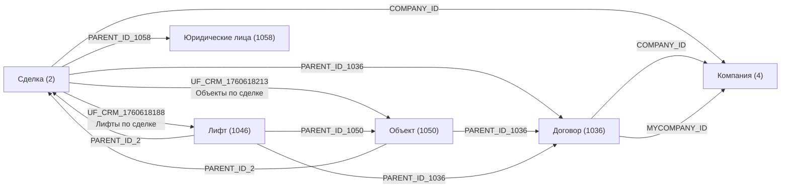
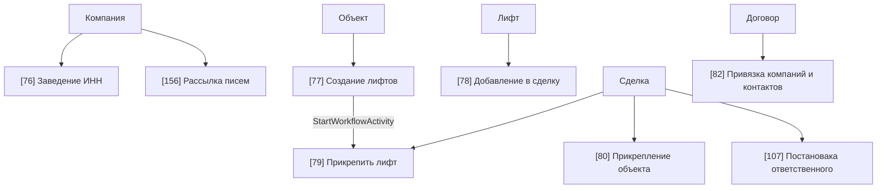

# ELVLift Portal Wiki

Снимок портала `b24.elvlift.ru` зафиксирован `2026-04-06 09:37:14 UTC` на основе REST-выгрузки через входящий вебхук с полными правами.

Эта wiki описывает только то, что подтверждено данными портала:

- CRM-сущности, воронки и стадии
- найденные шаблоны бизнес-процессов CRM
- поля и связи, реально используемые в автоматизациях
- ограничения REST-выгрузки

## Навигация

- [Модель CRM](crm/entity-model.md)
- [Воронки и стадии](crm/stages-and-funnels.md)
- [Каталог автоматизаций](automation/catalog.md)
- [Процесс: Объект -> Лифт -> Сделка](automation/processes/object-lift-deal.md)
- [Процессы: Компания, Договор, уведомления](automation/processes/company-contract-service.md)
- [Справочник полей](reference/fields.md)
- [Источники и границы данных](reference/sources-and-snapshot.md)

## Что найдено

- CRM-сущностей: `11`
- CRM-шаблонов автоматизации и бизнес-процессов: `8`
- Сущностей с найденными шаблонами: `5`
- Явных stage-bound шаблонов в `bizproc.workflow.template.list`: `0`

## Сущности, в которых есть шаблоны

| Сущность | `entityTypeId` | Шаблоны |
|---|---:|---|
| Сделки | 2 | 79, 80, 107 |
| Компании | 4 | 76, 156 |
| Договор | 1036 | 82 |
| Лифт | 1046 | 78 |
| Объект | 1050 | 77 |

## Главная рабочая связка сущностей

## Карта автоматизаций

## Ключевые выводы

1. Портал использует бизнес-процессы CRM как основной слой автоматизации.
2. Центральная рабочая цепочка проходит через `Объект`, `Лифт` и `Сделку`.
3. В REST-снимке нет отдельной выгрузки готовой карты роботов по стадиям сделок.
4. В шаблоне `[77]` присутствует единственная обнаруженная связь шаблон -> дочерний шаблон: запуск `[79]`.
