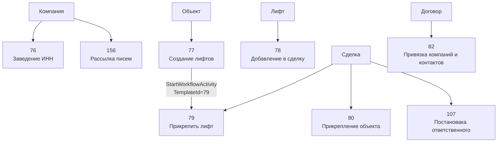

# Каталог автоматизаций

Назад: [Главная](../README.md)

## Общая сводка

На `2026-04-06` в CRM-шаблонах портала найдено `8` шаблонов.

| ID | Название | Базовая сущность | Режим запуска | Основные действия | Дочерние шаблоны |
|---:|---|---|---|---|---|
| 76 | Заведение ИНН | Компания | `on_create` | `CrmChangeRequisiteActivity` | — |
| 77 | Создание лифтов | Объект | `on_create_or_update` | `SetVariable`, `IfElse`, `SetField`, `While`, `CrmCreateDynamic`, `StartWorkflow`, `Terminate` | 79 |
| 78 | Добавление в сделку | Лифт | `on_create` | только корневой контейнер | — |
| 79 | Прикрепить лифт | Сделка | `manual` | `SetFieldActivity` | — |
| 80 | Прикрепление объекта | Сделка | `on_update` | `ForEachActivity`, `CrmUpdateDynamicActivity` | — |
| 82 | Привязка компаний и контактов | Договор | `manual` | `CrmGetDynamicInfoActivity` x2, `SetFieldActivity` | — |
| 107 | Постановака ответственного | Сделка | `manual` | `GetUserActivity`, `IMNotifyActivity`, `CrmChangeResponsibleActivity` | — |
| 156 | Рассылка писем | Компания | `manual` | `MailActivity` | — |

## Карта зависимостей

## Фактические свойства шаблонов

### `[76] Заведение ИНН`

- Базовая сущность: `Компания`
- `AUTO_EXECUTE = 1`
- Действие:
  - `CrmChangeRequisiteActivity`
- Источник значения:
  - `Document:UF_CRM_1760640732106` (`ИНН`)
- Записываемый реквизит:
  - `RQ_INN`

### `[77] Создание лифтов`

- Базовая сущность: `Объект`
- `AUTO_EXECUTE = 3`
- Структура:
  - `SetVariableActivity`
  - внешний `IfElseActivity`
  - `SetFieldActivity`
  - `WhileActivity`
  - `CrmCreateDynamicActivity`
  - `StartWorkflowActivity`
  - внутренний `IfElseActivity`
  - `TerminateActivity`
- Создаваемая сущность:
  - `DynamicTypeId = 1046` (`Лифт`)
- Запускаемый дочерний шаблон:
  - `TemplateId = 79`

### `[78] Добавление в сделку`

- Базовая сущность: `Лифт`
- `AUTO_EXECUTE = 1`
- В выгрузке шаблон содержит только корневой `SequentialWorkflowActivity`
- Дочерние действия отсутствуют

### `[79] Прикрепить лифт`

- Базовая сущность: `Сделка`
- `AUTO_EXECUTE = 0`
- Действие:
  - `SetFieldActivity`
- Изменяемое поле:
  - `UF_CRM_1760618188` (`Лифты по сделке`)
- Параметр запуска:
  - `Parameter1`

### `[80] Прикрепление объекта`

- Базовая сущность: `Сделка`
- `AUTO_EXECUTE = 2`
- Действия:
  - `ForEachActivity`
  - `CrmUpdateDynamicActivity`
- Итератор:
  - `UF_CRM_1760618213` (`Объекты по сделке`)
- Обновляемая сущность:
  - `DynamicTypeId = 1050` (`Объект`)

### `[82] Привязка компаний и контактов`

- Базовая сущность: `Договор`
- `AUTO_EXECUTE = 0`
- Действия:
  - `CrmGetDynamicInfoActivity`
  - `CrmGetDynamicInfoActivity`
  - `SetFieldActivity`
- Целевые поля документа:
  - `COMPANY_ID`
  - `MYCOMPANY_ID`

### `[107] Постановака ответственного`

- Базовая сущность: `Сделка`
- `AUTO_EXECUTE = 0`
- Действия:
  - `GetUserActivity`
  - `IMNotifyActivity`
  - `CrmChangeResponsibleActivity`
- В шаблоне шаг `CrmChangeResponsibleActivity` имеет `Activated = N`

### `[156] Рассылка писем`

- Базовая сущность: `Компания`
- `AUTO_EXECUTE = 0`
- Действие:
  - `MailActivity`
- Параметры:
  - `MailSubject = {=Template:Parameter1}`
  - `MailText = {=Template:Parameter2}`
  - `MailUserTo = i@egor-tsygankov.ru`

## Что не найдено в каталоге

1. В `bizproc.workflow.template.list` нет отдельных CRM-шаблонов, прямо привязанных к stage-кодам сделок или смарт-процессов.
2. В выгрузке нет шаблонов для лидов, предложений, смарт-счётов, `Марка лифта`, `Юридические лица`.
