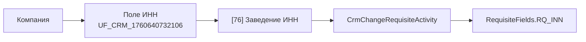
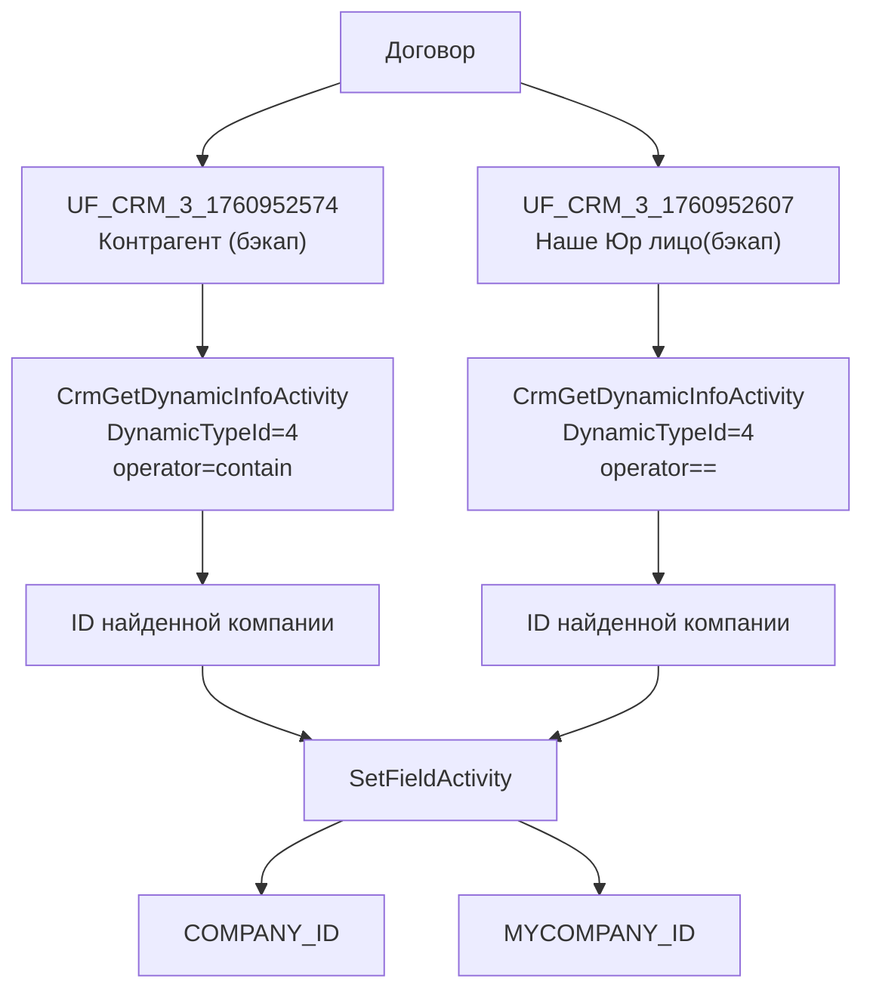
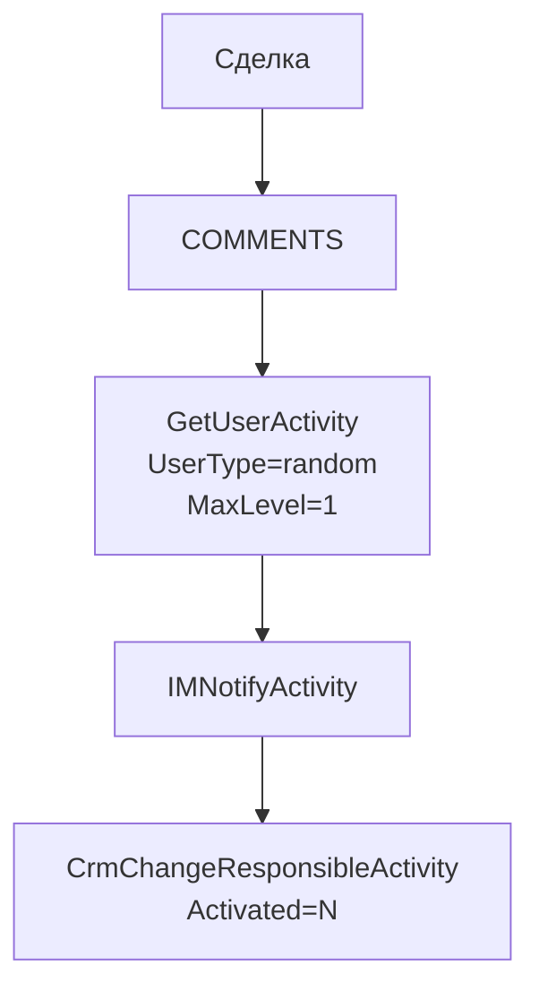
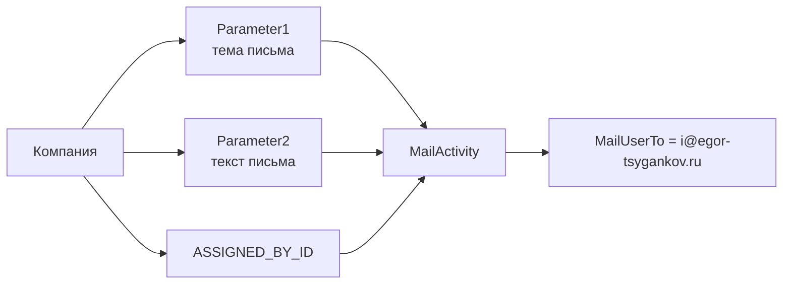

# Процессы: Компания, Договор, уведомления

Назад: [Каталог автоматизаций](../catalog.md)

## Состав раздела

| Шаблон | ID | Базовая сущность | Режим запуска |
|---|---:|---|---|
| Заведение ИНН | 76 | Компания | `on_create` |
| Привязка компаний и контактов | 82 | Договор | `manual` |
| Постановака ответственного | 107 | Сделка | `manual` |
| Рассылка писем | 156 | Компания | `manual` |

## `[76] Заведение ИНН`

### Подтверждённые свойства

| Параметр | Значение |
|---|---|
| Базовая сущность | `Компания` |
| Режим запуска | `on_create` |
| Action type | `CrmChangeRequisiteActivity` |
| `CrmEntityType` | `CONTACT` |
| `RequisitePresetId` | `1` |
| Источник ИНН | `Document:UF_CRM_1760640732106` |
| Целевой реквизит | `RQ_INN` |

## `[82] Привязка компаний и контактов`

### Подтверждённые шаги

1. Шаблон запускается вручную на сущности `Договор`.
2. Первый `CrmGetDynamicInfoActivity` ищет сущность с `DynamicTypeId = 4` по условию:
   - `TITLE contain {=Document:UF_CRM_3_1760952574}`
3. Второй `CrmGetDynamicInfoActivity` ищет сущность с `DynamicTypeId = 4` по условию:
   - `TITLE = {=Document:UF_CRM_3_1760952607}`
4. `SetFieldActivity` записывает:
   - `COMPANY_ID = ID первого запроса`
   - `MYCOMPANY_ID = ID второго запроса`

## `[107] Постановака ответственного`

### Подтверждённые свойства

| Параметр | Значение |
|---|---|
| Базовая сущность | `Сделка` |
| Режим запуска | `manual` |
| Источник выбора пользователя | `Document:COMMENTS` |
| `GetUserActivity.UserType` | `random` |
| `GetUserActivity.MaxLevel` | `1` |
| `ReserveUserParameter` | `user_3` |
| `IMNotifyActivity.MessageUserFrom` | `user_1` |
| `IMNotifyActivity.MessageUserTo` | `user_1` |
| Статус шага `CrmChangeResponsibleActivity` | `Activated = N` |

### Фактическая структура

1. Шаблон выбирает пользователя через `GetUserActivity`.
2. Затем выполняет `IMNotifyActivity`.
3. В шаблоне присутствует шаг смены ответственного.
4. В выгруженной структуре этот шаг помечен как неактивный.

## `[156] Рассылка писем`

### Подтверждённые свойства

| Параметр | Значение |
|---|---|
| Базовая сущность | `Компания` |
| Режим запуска | `manual` |
| `MailSubject` | `{=Template:Parameter1}` |
| `MailText` | `{=Template:Parameter2}` |
| `MailMessageType` | `plain` |
| `MailUserFromArray` | `{=Document:ASSIGNED_BY_ID}` |
| `MailUserTo` | `i@egor-tsygankov.ru` |

## Итог раздела

1. Шаблон `[76]` работает с реквизитами.
2. Шаблон `[82]` заполняет `COMPANY_ID` и `MYCOMPANY_ID` в договоре по строковым полям-бэкапам.
3. Шаблон `[107]` содержит уведомление и неактивный шаг смены ответственного.
4. Шаблон `[156]` отправляет письмо на фиксированный адрес.
