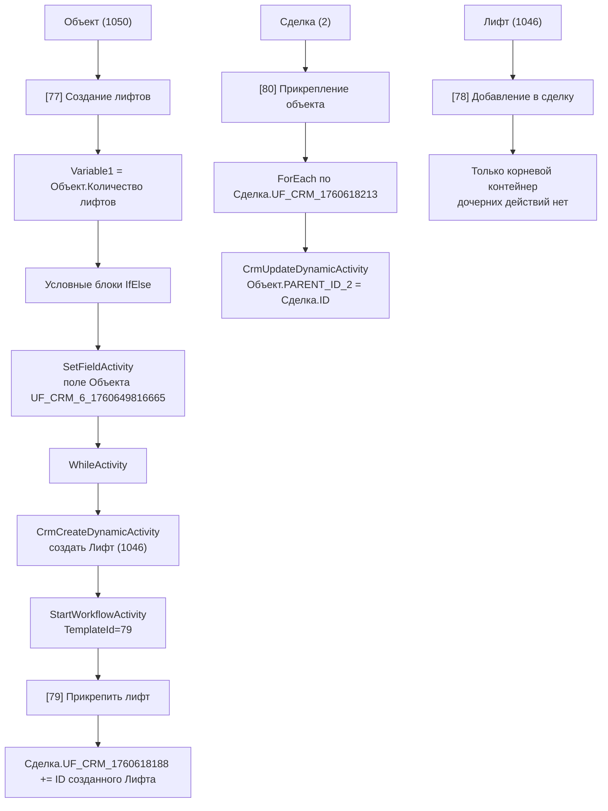

# Процесс: Объект -> Лифт -> Сделка

Назад: [Каталог автоматизаций](../catalog.md)

## Входящие шаблоны процесса

| Шаблон | ID | Базовая сущность | Режим запуска |
|---|---:|---|---|
| Создание лифтов | 77 | Объект | `on_create_or_update` |
| Прикрепить лифт | 79 | Сделка | `manual` |
| Прикрепление объекта | 80 | Сделка | `on_update` |
| Добавление в сделку | 78 | Лифт | `on_create` |

## Общая схема процесса

## Шаблон `[77] Создание лифтов`

### Подтверждённые шаги

1. Шаблон запускается на сущности `Объект`.
2. `SetVariableActivity` записывает в `Variable1` значение поля `UF_CRM_6_1760643248` (`Количество лифтов`).
3. В шаблоне присутствует внешний блок `IfElseActivity`.
4. Внутри одной из веток выполняется `SetFieldActivity` по полю `UF_CRM_6_1760649816665` (`Лифты созданы?`).
5. Затем выполняется `WhileActivity`.
6. Внутри цикла `CrmCreateDynamicActivity` создаёт элемент сущности `Лифт` (`DynamicTypeId = 1046`).
7. После создания лифта вызывается `StartWorkflowActivity` с `TemplateId = 79`.
8. Параметр `Parameter1` дочернего шаблона получает значение `{=A16680_24452_19825_18929:ItemId}`.
9. После запуска дочернего шаблона `SetVariableActivity` уменьшает `Variable1` на единицу.
10. Внутри второго блока `IfElseActivity` присутствует `TerminateActivity`.

### Поля, которые шаблон `[77]` передаёт в новую карточку `Лифт`

| Поле `Лифта` | Источник |
|---|---|
| `1046_TITLE` | строка `Лифт {{=randstring(4)}}` |
| `1046_ASSIGNED_BY_ID` | `Объект.ASSIGNED_BY_ID` |
| `1046_OPENED` | константа `Y` |
| `1046_BEGINDATE` | `System:Date` |
| `1046_CLOSEDATE` | `workdateadd(System:Date, "+10d")` |
| `1046_COMPANY_ID` | `Объект.COMPANY_ID` |
| `1046_CATEGORY_ID` | константа `8` |
| `1046_PARENT_ID_2` | `Объект.PARENT_ID_2` |
| `1046_PARENT_ID_1036` | `Объект.PARENT_ID_1036` |
| `1046_PARENT_ID_1050` | `Объект.ID` |

### Контракт запуска дочернего шаблона `[79]`

| Поле | Значение |
|---|---|
| Целевой документ | `DocumentId = {=Document:PARENT_ID_2}` |
| Целевой шаблон | `TemplateId = 79` |
| Передаваемый параметр | `Parameter1 = ID созданного лифта` |

## Шаблон `[79] Прикрепить лифт`

### Подтверждённые шаги

1. Шаблон запускается вручную на сущности `Сделка`.
2. Он использует один параметр запуска: `Parameter1`.
3. `SetFieldActivity` записывает `Parameter1` в поле `UF_CRM_1760618188` (`Лифты по сделке`).
4. Поле обновляется в режиме `MergeMultipleFields = Y`.

### Фактический результат

Шаблон `[79]` добавляет идентификатор лифта в мультиполе сделки `Лифты по сделке`.

## Шаблон `[80] Прикрепление объекта`

### Подтверждённые шаги

1. Шаблон запускается на обновлении `Сделки`.
2. `ForEachActivity` итерирует значения поля `UF_CRM_1760618213` (`Объекты по сделке`).
3. Внутри цикла `CrmUpdateDynamicActivity` обновляет сущность `Объект` (`DynamicTypeId = 1050`).
4. Фильтр обновления:
   - `ID = текущее значение итератора`
5. Обновляемое поле:
   - `PARENT_ID_2 = ID текущей сделки`

### Контракт обновления объекта

| Поле | Значение |
|---|---|
| Целевая сущность | `Объект (1050)` |
| Критерий поиска | `Object.ID = текущий элемент UF_CRM_1760618213` |
| Изменяемое поле | `PARENT_ID_2` |
| Источник значения | `Deal.ID` |

## Шаблон `[78] Добавление в сделку`

### Факт

В выгрузке шаблон `[78]` содержит только корневой `SequentialWorkflowActivity`.
Внутри шаблона нет дочерних действий.

### Следствие для документации

На дату снимка шаблон `[78]` не даёт исполняемой логики, которую можно разложить по шагам.
