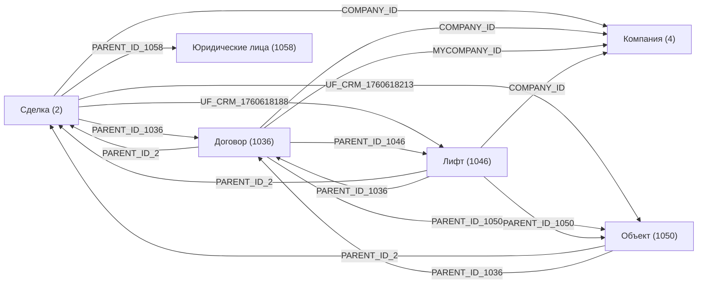

# Модель CRM

Назад: [Главная](../README.md)

## Область модели

В этом разделе перечислены CRM-сущности портала и их связи, подтверждённые REST-метаданными и найденными шаблонами.

## Список сущностей

| Сущность | `entityTypeId` | Категории | Стадии | Шаблоны |
|---|---:|---:|---:|---:|
| Лиды | 1 | 1 | 3 | 0 |
| Сделки | 2 | 4 | 34 | 3 |
| Контакты | 3 | 3 | 0 | 0 |
| Компании | 4 | 2 | 0 | 2 |
| Предложения | 7 | 1 | 5 | 0 |
| Смарт-счета | 31 | 1 | 0 | 0 |
| Договор | 1036 | 1 | 5 | 1 |
| Лифт | 1046 | 1 | 5 | 1 |
| Объект | 1050 | 1 | 5 | 1 |
| Марка лифта | 1054 | 1 | 5 | 0 |
| Юридические лица | 1058 | 1 | 5 | 0 |

## Коммерческое ядро портала

| Сущность | Назначение в данных портала | Основные связи |
|---|---|---|
| Сделка | Главная коммерческая сущность | `COMPANY_ID`, `PARENT_ID_1036`, `UF_CRM_1760618213`, `UF_CRM_1760618188`, `PARENT_ID_1058` |
| Договор | Смарт-процесс договора | `COMPANY_ID`, `MYCOMPANY_ID`, `PARENT_ID_2`, `PARENT_ID_1046`, `PARENT_ID_1050` |
| Объект | Смарт-процесс объекта проекта | `PARENT_ID_2`, `PARENT_ID_1036`, `PARENT_ID_1046` |
| Лифт | Смарт-процесс отдельного лифта | `PARENT_ID_2`, `PARENT_ID_1036`, `PARENT_ID_1050`, `COMPANY_ID` |
| Компания | Карточка контрагента | `PARENT_ID_1036`, `PARENT_ID_1050`, поле `ИНН` |
| Юридические лица | Отдельный смарт-процесс | связь на сделке через `PARENT_ID_1058` |

## Диаграмма связей

## Сущности с активным automation-слоем

### Сделка

- Поля-связки:
  - `UF_CRM_1760618188` — `Лифты по сделке`
  - `UF_CRM_1760618213` — `Объекты по сделке`
  - `PARENT_ID_1036` — `Договор`
  - `PARENT_ID_1046` — `Лифт`
  - `PARENT_ID_1050` — `Объект`
  - `PARENT_ID_1058` — `Юридические лица`
- Найденные шаблоны: `79`, `80`, `107`

### Компания

- Поле, используемое в автоматизации:
  - `UF_CRM_1760640732106` — `ИНН`
- Найденные шаблоны: `76`, `156`

### Договор

- Поля, используемые в автоматизации:
  - `UF_CRM_3_1760952574` — `Контрагент (бэкап)`
  - `UF_CRM_3_1760952607` — `Наше Юр лицо(бэкап)`
  - `COMPANY_ID`
  - `MYCOMPANY_ID`
- Найденный шаблон: `82`

### Объект

- Поля, используемые в автоматизации:
  - `UF_CRM_6_1760643248` — `Количество лифтов`
  - `UF_CRM_6_1760649816665` — `Лифты созданы?`
  - `PARENT_ID_2` — `Сделка`
  - `PARENT_ID_1036` — `Договор`
- Найденный шаблон: `77`

### Лифт

- В найденной автоматизации участвует как создаваемая сущность из шаблона `[77]`
- Найденный шаблон на самой сущности: `78`

## Сущности без найденных шаблонов

| Сущность | `entityTypeId` | Примечание |
|---|---:|---|
| Лиды | 1 | Шаблоны в REST не найдены |
| Контакты | 3 | Шаблоны в REST не найдены |
| Предложения | 7 | Шаблоны в REST не найдены |
| Смарт-счета | 31 | Шаблоны в REST не найдены |
| Марка лифта | 1054 | Шаблоны в REST не найдены |
| Юридические лица | 1058 | Шаблоны в REST не найдены |
