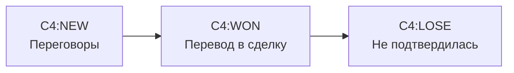
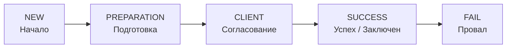

# Воронки и стадии

Назад: [Главная](../README.md)

## Как читать диаграммы

Диаграммы ниже показывают порядок стадий по полю `SORT` из `crm.status.list`.
Они не описывают допустимые переходы между стадиями. Они фиксируют порядок и состав стадий в портале на дату снимка.

## Сделки

### Воронка `Коммерческая воронка` (`CATEGORY_ID = 0`)

| Порядок | Код стадии | Название |
|---:|---|---|
| 1 | `NEW` | Анализ ТЗ |
| 2 | `UC_MKIYN6` | Подготовка и отправка КП |
| 3 | `UC_I070YF` | Переговоры |
| 4 | `EXECUTING` | Согласование договора |
| 5 | `UC_WFZPF0` | Счет на аванс |
| 6 | `FINAL_INVOICE` | Аванс получен |
| 7 | `UC_1LOS62` | Оборудование |
| 8 | `2` | Монтаж |
| 9 | `3` | Окончательный расчет |
| 10 | `WON` | Сделка успешна |
| 11 | `LOSE` | Сделка провалена |

```mermaid
flowchart LR
  A["NEW\nАнализ ТЗ"] --> B["UC_MKIYN6\nПодготовка и отправка КП"]
  B --> C["UC_I070YF\nПереговоры"]
  C --> D["EXECUTING\nСогласование договора"]
  D --> E["UC_WFZPF0\nСчет на аванс"]
  E --> F["FINAL_INVOICE\nАванс получен"]
  F --> G["UC_1LOS62\nОборудование"]
  G --> H["2\nМонтаж"]
  H --> I["3\nОкончательный расчет"]
  I --> J["WON\nСделка успешна"]
  J --> K["LOSE\nСделка провалена"]
```

### Воронка `Тендерная продажа` (`CATEGORY_ID = 1`)

| Порядок | Код стадии | Название |
|---:|---|---|
| 1 | `C1:NEW` | Новый тендер |
| 2 | `C1:PREPARATION` | Смета/расчет |
| 3 | `C1:PREPAYMENT_INVOICE` | Согласование |
| 4 | `C1:EXECUTING` | Подача заявки |
| 5 | `C1:FINAL_INVOICE` | Торги |
| 6 | `C1:1` | Ожидание итогов |
| 7 | `C1:2` | Выполнение обязательств |
| 8 | `C1:3` | Окончательный расчет |
| 9 | `C1:WON` | Сделка успешна |
| 10 | `C1:LOSE` | Сделка провалена |

```mermaid
flowchart LR
  A["C1:NEW\nНовый тендер"] --> B["C1:PREPARATION\nСмета/расчет"]
  B --> C["C1:PREPAYMENT_INVOICE\nСогласование"]
  C --> D["C1:EXECUTING\nПодача заявки"]
  D --> E["C1:FINAL_INVOICE\nТорги"]
  E --> F["C1:1\nОжидание итогов"]
  F --> G["C1:2\nВыполнение обязательств"]
  G --> H["C1:3\nОкончательный расчет"]
  H --> I["C1:WON\nСделка успешна"]
  I --> J["C1:LOSE\nСделка провалена"]
```

### Воронка `Продажа по ФЗ` (`CATEGORY_ID = 2`)

| Порядок | Код стадии | Название |
|---:|---|---|
| 1 | `C2:NEW` | Новый тендер |
| 2 | `C2:PREPARATION` | Расчет/смета |
| 3 | `C2:PREPAYMENT_INVOICE` | Согласование |
| 4 | `C2:EXECUTING` | Подача заявки |
| 5 | `C2:FINAL_INVOICE` | Торги |
| 6 | `C2:UC_UMTNQO` | Ожидание итогов |
| 7 | `C2:UC_G71QY3` | Выполнение обязательств |
| 8 | `C2:UC_ZWM3RV` | Окончательный расчет |
| 9 | `C2:WON` | Сделка успешна |
| 10 | `C2:LOSE` | Сделка провалена |

```mermaid
flowchart LR
  A["C2:NEW\nНовый тендер"] --> B["C2:PREPARATION\nРасчет/смета"]
  B --> C["C2:PREPAYMENT_INVOICE\nСогласование"]
  C --> D["C2:EXECUTING\nПодача заявки"]
  D --> E["C2:FINAL_INVOICE\nТорги"]
  E --> F["C2:UC_UMTNQO\nОжидание итогов"]
  F --> G["C2:UC_G71QY3\nВыполнение обязательств"]
  G --> H["C2:UC_ZWM3RV\nОкончательный расчет"]
  H --> I["C2:WON\nСделка успешна"]
  I --> J["C2:LOSE\nСделка провалена"]
```

### Воронка `Долгосрочная` (`CATEGORY_ID = 4`)

| Порядок | Код стадии | Название |
|---:|---|---|
| 1 | `C4:NEW` | Переговоры |
| 2 | `C4:WON` | Перевод в сделку |
| 3 | `C4:LOSE` | Не подтвердилась |

## Смарт-процессы со стадиями

### Договор (`entityTypeId = 1036`, воронка `Общая`, `CATEGORY_ID = 6`)

| Порядок | Код стадии | Название |
|---:|---|---|
| 1 | `DT1036_6:NEW` | Начало |
| 2 | `DT1036_6:PREPARATION` | Подготовка |
| 3 | `DT1036_6:CLIENT` | Согласование |
| 4 | `DT1036_6:SUCCESS` | Заключен |
| 5 | `DT1036_6:FAIL` | Провал |

### Лифт (`entityTypeId = 1046`, воронка `Общая`, `CATEGORY_ID = 8`)

| Порядок | Код стадии | Название |
|---:|---|---|
| 1 | `DT1046_8:NEW` | Начало |
| 2 | `DT1046_8:PREPARATION` | Подготовка |
| 3 | `DT1046_8:CLIENT` | Согласование |
| 4 | `DT1046_8:SUCCESS` | Успех |
| 5 | `DT1046_8:FAIL` | Провал |

### Объект (`entityTypeId = 1050`, воронка `Общая`, `CATEGORY_ID = 9`)

| Порядок | Код стадии | Название |
|---:|---|---|
| 1 | `DT1050_9:NEW` | Начало |
| 2 | `DT1050_9:PREPARATION` | Подготовка |
| 3 | `DT1050_9:CLIENT` | Согласование |
| 4 | `DT1050_9:SUCCESS` | Успех |
| 5 | `DT1050_9:FAIL` | Провал |

### Марка лифта (`entityTypeId = 1054`, воронка `Общая`, `CATEGORY_ID = 10`)

| Порядок | Код стадии | Название |
|---:|---|---|
| 1 | `DT1054_10:NEW` | Начало |
| 2 | `DT1054_10:PREPARATION` | Подготовка |
| 3 | `DT1054_10:CLIENT` | Согласование |
| 4 | `DT1054_10:SUCCESS` | Успех |
| 5 | `DT1054_10:FAIL` | Провал |

### Юридические лица (`entityTypeId = 1058`, воронка `Общая`, `CATEGORY_ID = 11`)

| Порядок | Код стадии | Название |
|---:|---|---|
| 1 | `DT1058_11:NEW` | Начало |
| 2 | `DT1058_11:PREPARATION` | Подготовка |
| 3 | `DT1058_11:CLIENT` | Согласование |
| 4 | `DT1058_11:SUCCESS` | Успех |
| 5 | `DT1058_11:FAIL` | Провал |

## Сущности с категориями без REST-стадий

| Сущность | Категории |
|---|---|
| Контакты | `Общая воронка`, `Category 1`, `Контакты поставщика` |
| Компании | `Общая воронка`, `Поставщики` |
| Смарт-счета | `Основная` |

По этим сущностям `crm.category.list` вернул категории, но `crm.status.list` в рамках текущего аудита не дал отдельного набора стадий.
