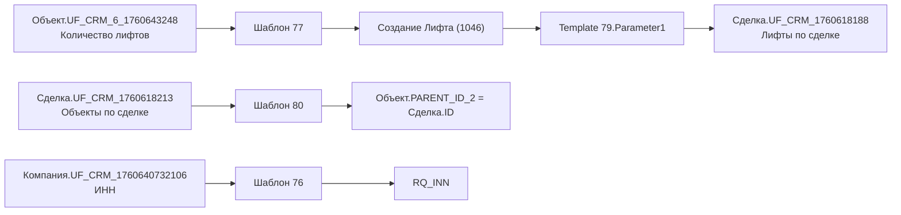

# Справочник полей

Назад: [Главная](../README.md)

## Принцип отбора

В таблицы включены поля, которые:

1. используются найденными шаблонами;
2. участвуют в связях между сущностями;
3. имеют подтверждённое название через `crm.deal.fields`, `crm.company.fields` или `crm.item.fields`.

## Сделка

| Код поля | Название | Тип | Использование |
|---|---|---|---|
| `UF_CRM_1760618188` | Лифты по сделке | `crm`, множественное | шаблон `[79]` добавляет ID лифта |
| `UF_CRM_1760618213` | Объекты по сделке | `crm`, множественное | шаблон `[80]` итерирует значения |
| `COMMENTS` | Комментарий | `string` | шаблон `[107]` передаёт в `GetUserActivity` |
| `COMPANY_ID` | Компания | `crm_company` | базовая связь сделки с компанией |
| `PARENT_ID_1036` | Договор | `crm_entity` | связь сделки с договором |
| `PARENT_ID_1046` | Лифт | `crm_entity` | связь сделки с лифтом |
| `PARENT_ID_1050` | Объект | `crm_entity` | связь сделки с объектом |
| `PARENT_ID_1058` | Юридические лица | `crm_entity` | связь сделки с сущностью `Юридические лица` |

## Компания

| Код поля | Название | Тип | Использование |
|---|---|---|---|
| `UF_CRM_1760640732106` | ИНН | `string` | шаблон `[76]` передаёт в `RQ_INN` |
| `ASSIGNED_BY_ID` | Ответственный | `user` | шаблон `[156]` использует как отправителя |
| `PARENT_ID_1036` | Договор | `crm_entity` | связь карточки компании с договором |
| `PARENT_ID_1050` | Объект | `crm_entity` | связь карточки компании с объектом |

## Объект (`entityTypeId = 1050`)

| Код поля | Название | Тип | Использование |
|---|---|---|---|
| `UF_CRM_6_1760643117` | Адрес проекта | `address` | поле сущности |
| `UF_CRM_6_1760643150` | Тип услуги | `enumeration` | поле сущности |
| `UF_CRM_6_1760643248` | Количество лифтов | `double` | шаблон `[77]` записывает в `Variable1` |
| `UF_CRM_6_1760643330` | Бюджет объекта | `money` | поле сущности |
| `UF_CRM_6_1760643356` | ID проекта | `double` | поле сущности |
| `UF_CRM_6_1760649816665` | Лифты созданы? | `enumeration` | шаблон `[77]` меняет через `SetFieldActivity` |
| `PARENT_ID_2` | Сделка | `crm_entity` | шаблон `[80]` записывает ID сделки |
| `PARENT_ID_1036` | Договор | `crm_entity` | шаблон `[77]` передаёт в создаваемый лифт |

## Лифт (`entityTypeId = 1046`)

| Код поля | Название | Тип | Использование |
|---|---|---|---|
| `UF_CRM_5_1760645280` | Этажность | `double` | поле сущности |
| `UF_CRM_5_1760645295` | Серийный номер | `string` | поле сущности |
| `UF_CRM_5_1760645332` | Старт эксплуатации | `date` | поле сущности |
| `UF_CRM_5_1760645345` | Дата окончания гарантийного обслуживания | `date` | поле сущности |
| `UF_CRM_5_1760648236` | Марка лифта | `enumeration` | поле сущности |
| `PARENT_ID_2` | Сделка | `crm_entity` | шаблон `[77]` передаёт при создании |
| `PARENT_ID_1036` | Договор | `crm_entity` | шаблон `[77]` передаёт при создании |
| `PARENT_ID_1050` | Объект | `crm_entity` | шаблон `[77]` передаёт при создании |
| `COMPANY_ID` | Компания | `crm_company` | шаблон `[77]` передаёт при создании |

## Договор (`entityTypeId = 1036`)

| Код поля | Название | Тип | Использование |
|---|---|---|---|
| `UF_CRM_3_1760952550` | Контрагент | `crm` | поле сущности |
| `UF_CRM_3_1760952574` | Контрагент (бэкап) | `string` | шаблон `[82]` использует в фильтре поиска |
| `UF_CRM_3_1760952607` | Наше Юр лицо(бэкап) | `string` | шаблон `[82]` использует в фильтре поиска |
| `COMPANY_ID` | Компания | `crm_company` | шаблон `[82]` заполняет |
| `MYCOMPANY_ID` | Реквизиты вашей компании | `crm_company` | шаблон `[82]` заполняет |
| `PARENT_ID_2` | Сделка | `crm_entity` | поле связи |
| `PARENT_ID_1046` | Лифт | `crm_entity` | поле связи |
| `PARENT_ID_1050` | Объект | `crm_entity` | поле связи |

## Технические параметры шаблонов

| Шаблон | Код | Назначение |
|---|---|---|
| `[79] Прикрепить лифт` | `Parameter1` | принимает ID созданного лифта |
| `[156] Рассылка писем` | `Parameter1` | тема письма |
| `[156] Рассылка писем` | `Parameter2` | текст письма |

## Поля, по которым подтверждена автоматическая передача данных

